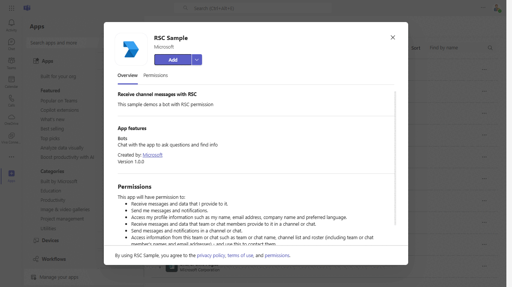
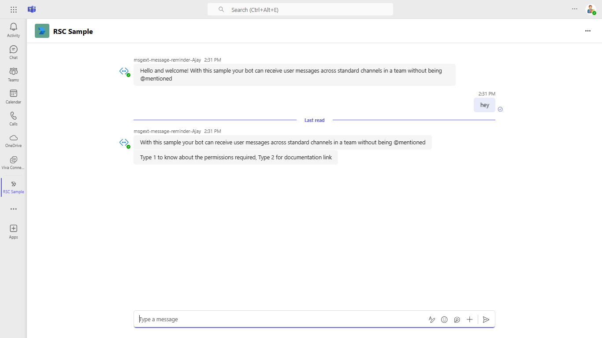
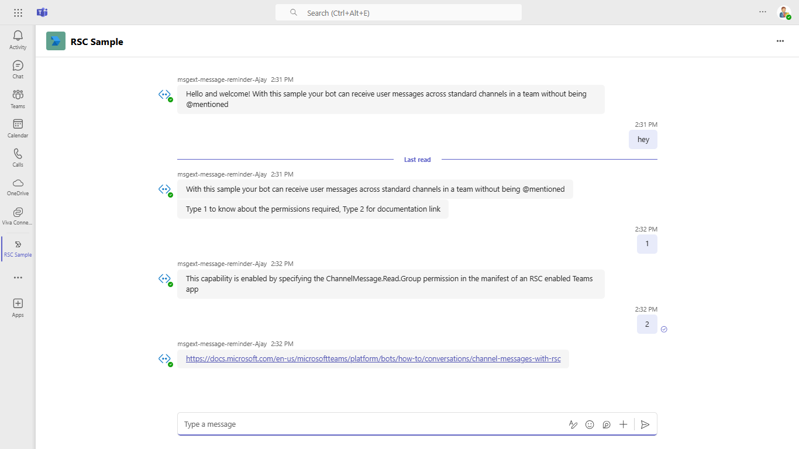
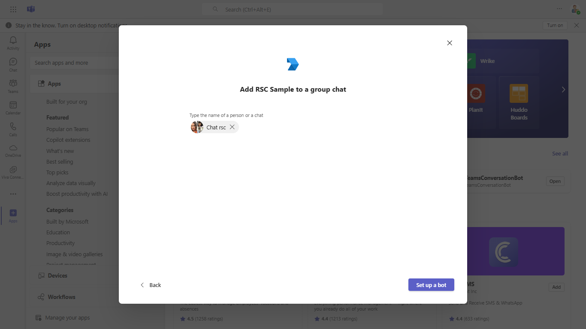
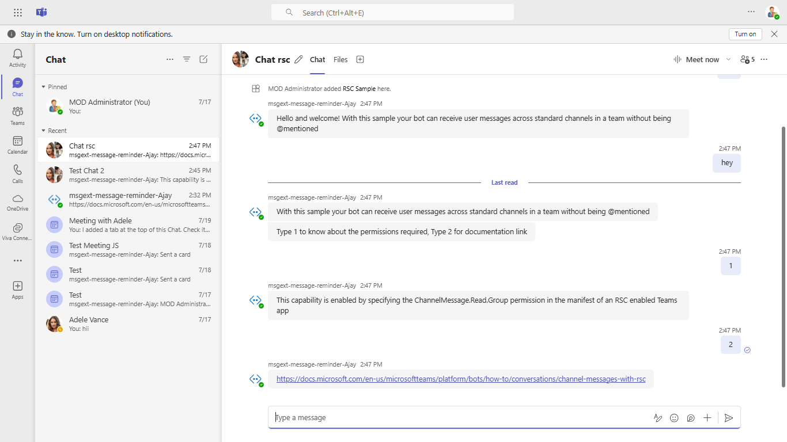

# Receive Channel messages with RSC permissions

This sample app illustrates how a bot can capture all channel messages in Microsoft Teams by utilizing RSC (resource-specific consent) permissions, eliminating the need for @mentions. The bot supports adaptive card responses, easy local testing with tools like ngrok or dev tunnels, and deployment to Azure, allowing it to function effectively across different channels and group chats in Teams.

This feature shown in this sample is currently available in Public Developer Preview only.

## Included Features
* Bots
* Adaptive Cards
* RSC Permissions

## Interaction with app



## Try it yourself - experience the App in your Microsoft Teams client
Please find below demo manifest which is deployed on Microsoft Azure and you can try it yourself by uploading the app package (.zip file link below) to your teams and/or as a personal app. (Uploading must be enabled for your tenant, [see steps here](https://docs.microsoft.com/microsoftteams/platform/concepts/build-and-test/prepare-your-o365-tenant#enable-custom-teams-apps-and-turn-on-custom-app-uploading)).

**Receive Channel messages with RSC permissions:** [Manifest](/samples/bot-receive-channel-messages-withRSC/csharp/demo-manifest/Bot-RSC.zip)

## Prerequisites

1. Office 365 tenant. You can get a free tenant for development use by signing up for the [Office 365 Developer Program](https://developer.microsoft.com/en-us/microsoft-365/dev-program).

2. To test locally, [NodeJS](https://nodejs.org/en/download/) must be installed on your development machine (version 16.14.2  or higher).

    ```bash
    # determine node version
    node --version
    ```
3. [dev tunnel](https://learn.microsoft.com/en-us/azure/developer/dev-tunnels/get-started?tabs=windows) or [Ngrok](https://ngrok.com/download) (For local environment testing) latest version (any other tunneling software can also be used)

   If you are using Ngrok to test locally, you'll need [Ngrok](https://ngrok.com/) installed on your development machine.
   Make sure you've downloaded and installed Ngrok on your local machine. ngrok will tunnel requests from the Internet to your local computer and terminate the SSL connection from Teams.

4. [Microsoft 365 Agents Toolkit for VS Code](https://marketplace.visualstudio.com/items?itemName=TeamsDevApp.ms-teams-vscode-extension) or [TeamsFx CLI](https://learn.microsoft.com/microsoftteams/platform/toolkit/teamsfx-cli?pivots=version-one)

## Run the app (Using Microsoft 365 Agents Toolkit for Visual Studio Code)

The simplest way to run this sample in Teams is to use Microsoft 365 Agents Toolkit for Visual Studio Code.

1. Ensure you have downloaded and installed [Visual Studio Code](https://code.visualstudio.com/docs/setup/setup-overview)
1. Install the [Microsoft 365 Agents Toolkit extension](https://marketplace.visualstudio.com/items?itemName=TeamsDevApp.ms-teams-vscode-extension)
1. Select **File > Open Folder** in VS Code and choose this samples directory from the repo
1. Using the extension, sign in with your Microsoft 365 account where you have permissions to upload custom apps
1. Select **Debug > Start Debugging** or **F5** to run the app in a Teams web client.
1. In the browser that launches, select the **Add** button to install the app to Teams.

> If you do not have permission to upload custom apps (uploading), Microsoft 365 Agents Toolkit will recommend creating and using a Microsoft 365 Developer Program account - a free program to get your own dev environment sandbox that includes Teams.

## Setup

> NOTE: The free ngrok plan will generate a new URL every time you run it, which requires you to update your Azure AD registration, the Teams app manifest, and the project configuration. A paid account with a permanent ngrok URL is recommended.

1) Setup for Bot
- Register Azure AD application
- Register a bot with Azure Bot Service, following the instructions [here](https://docs.microsoft.com/azure/bot-service/bot-service-quickstart-registration?view=azure-bot-service-3.0).

- Ensure that you've [enabled the Teams Channel](https://docs.microsoft.com/azure/bot-service/channel-connect-teams?view=azure-bot-service-4.0)
- While registering the bot, use `https://<your_tunnel_domain>/api/messages` as the messaging endpoint.
    
    > NOTE: When you create your app registration in Azure portal, you will create an App ID and App password - make sure you keep these for later.

2) Setup NGROK
 - Run ngrok - point to port 3978

   ```bash
   ngrok http 3978 --host-header="localhost:3978"
   ```  

   Alternatively, you can also use the `dev tunnels`. Please follow [Create and host a dev tunnel](https://learn.microsoft.com/en-us/azure/developer/dev-tunnels/get-started?tabs=windows) and host the tunnel with anonymous user access command as shown below:

   ```bash
   devtunnel host -p 3978 --allow-anonymous
   ```

3) Setup for code
- Clone the repository

    ```bash
    git clone https://github.com/OfficeDev/Microsoft-Teams-Samples.git
    ```

- In the folder where repository is cloned navigate to `samples/bot-receive-channel-messages-withRSC/nodejs`

- Install node modules

   Inside node js folder, open your local terminal and run the below command to install node modules. You can do the same in Visual Studio code terminal by opening the project in Visual Studio code.

    ```bash
    npm install
    ```
- Update the `.env` configuration for the bot to use the `MicrosoftAppId` (Microsoft App Id) and `MicrosoftAppPassword` (App Password) from the Microsoft Entra ID app registration in Azure portal or from Bot Framework registration. 
> NOTE: the App Password is referred to as the `client secret` in the azure portal app registration service and you can always create a new client secret anytime.

- Run your app
    ```bash
    npm start
    ```
- Install modules & Run the NodeJS Server
  - Server will run on PORT: 3978
  - Open a terminal and navigate to project root directory
  
  ```bash
    npm run server
  ```
> NOTE:This command is equivalent to: npm install > npm start

4) Run your app

    ```bash
    npm start
    ```
5) Setup Manifest for Teams

    - **Edit** the `manifest.json` contained in the `appManifest` folder to replace your Microsoft App Id (that was created when you registered your bot earlier) *everywhere* you see the place holder string `<<YOUR-MICROSOFT-APP-ID>>` (depending on the scenario the Microsoft App Id may occur multiple times in the `manifest.json`) 
        `<<DOMAIN-NAME>>` with base Url domain. E.g. if you are using ngrok it would be `https://1234.ngrok-free.app` then your domain-name will be `1234.ngrok-free.app` and if you are using dev tunnels then your domain will be like: `12345.devtunnels.ms`.
         Replace <<MANIFEST-ID>> with any GUID or with your MicrosoftAppId/app id

    - **Zip** up the contents of the `appManifest` folder to create a `manifest.zip`
    - **Upload** in a team to test
         - Select or create a team
         - Select the ellipses **...** from the left pane. The drop-down menu appears.
         - Select **Manage Team**, then select **Apps** 
         - Then select **Upload a custom app** from the lower right corner.
         - Then select the `manifest.zip` file from `appManifest`, and then select **Add** to add the bot to your selected team.

**Note**: If you are facing any issue in your app, please uncomment [this](https://github.com/OfficeDev/Microsoft-Teams-Samples/blob/main/samples/bot-receive-channel-messages-withRSC/nodejs/server/api/botController.js#L24) line and put your debugger for local debug.

## Running the sample

**Adding bot UI:**


**Hey command interaction:**



**1 or 2 command interaction:**

 

**Adding App to group chat:**

 

**Group chat interaction with bot without being @mentioned:**

 

**Interacting with the bot in Teams**

Select a channel and enter a message in the channel for your bot.

The bot receives the message without being @mentioned.

## Deploy the bot to Azure

To learn more about deploying a bot to Azure, see [Deploy your bot to Azure](https://aka.ms/azuredeployment) for a complete list of deployment instructions.

## Further reading

- [Bot Framework Documentation](https://docs.botframework.com)
- [Bot Basics](https://docs.microsoft.com/azure/bot-service/bot-builder-basics?view=azure-bot-service-4.0)
- [Azure Bot Service Introduction](https://docs.microsoft.com/azure/bot-service/bot-service-overview-introduction?view=azure-bot-service-4.0)
- [Azure Bot Service Documentation](https://docs.microsoft.com/azure/bot-service/?view=azure-bot-service-4.0)
- [Receive Channel messages with RSC](https://docs.microsoft.com/microsoftteams/platform/bots/how-to/conversations/channel-messages-with-rsc)


- https://www.npmjs.com/package/botbuilder#installing
- https://github.com/microsoft/BotBuilder-Samples/tree/main/experimental/generation
- https://github.com/microsoft/BotBuilder-Samples/tree/main/samples/javascript_nodejs/44.prompt-for-user-input
- https://github.com/microsoft/BotBuilder-Samples/tree/main/samples/javascript_nodejs/19.custom-dialogs
- https://github.com/microsoft/BotBuilder-Samples/tree/main/samples/javascript_nodejs/17.multilingual-bot
- https://github.com/microsoft/BotBuilder-Samples/tree/main/samples/javascript_nodejs/05.multi-turn-prompt
- https://github.com/microsoft/BotBuilder-Samples/tree/main/samples/javascript_nodejs/06.using-cards
- https://github.com/microsoft/BotBuilder-Samples/tree/main/samples/javascript_nodejs/07.using-adaptive-cards
- https://github.com/microsoft/BotBuilder-Samples/tree/main/samples/javascript_nodejs/15.handling-attachments
- https://github.com/microsoft/BotBuilder-Samples/tree/main/samples/javascript_nodejs/43.complex-dialog
- https://learn.microsoft.com/en-us/azure/bot-service/bot-service-overview?view=azure-bot-service-4.0
- https://learn.microsoft.com/en-us/javascript/api/botbuilder/?view=botbuilder-ts-latest
- https://www.npmjs.com/package/botbuilder-dialogs#learn-more
- https://learn.microsoft.com/en-us/azure/bot-service/bot-service-overview?view=azure-bot-service-4.0
- https://learn.microsoft.com/en-us/javascript/api/botbuilder-dialogs/?view=botbuilder-ts-latest
- https://github.com/Microsoft/botframework-sdk?tab=readme-ov-file
- https://github.com/Microsoft/botbuilder-js
- https://github.com/howdyai/botkit#readme
- https://github.com/howdyai/botkit/tree/main/packages/botbuilder-adapter-slack#readme
- https://github.com/BotBuilderCommunity/botbuilder-community-js/blob/master/libraries/botbuilder-adapter-console/README.md
- https://github.com/BotBuilderCommunity/botbuilder-community-js/blob/master/libraries/botbuilder-adapter-alexa/README.md
- https://github.com/BotBuilderCommunity/botbuilder-community-js/tree/master/samples/adapter-alexa
- https://github.com/BotBuilderCommunity/botbuilder-community-js/blob/master/libraries/botbuilder-dialog-prompts/README.md
- https://github.com/microsoft/Recognizers-Text
- https://github.com/BotBuilderCommunity/botbuilder-community-js/tree/master/samples/dialog-prompts
- https://github.com/BotBuilderCommunity/botbuilder-community-js/blob/master/libraries/botbuilder-storage-mongodb/README.md
- https://github.com/howdyai/botkit/blob/main/packages/docs/index.md
- https://learn.microsoft.com/en-us/azure/bot-service/rest-api/bot-framework-rest-connector-authentication?view=azure-bot-service-4.0&tabs=multitenant

---

## Changelog

### v2 — Notification Queue, Daily Recap Cards, Architecture Modernisation

This release adds a Redis-backed notification queue consumer, a daily recap Adaptive Card system, and a major architectural cleanup (shared adapter, shared Redis factory, rate limiting, auth).

---

#### New Features

**Daily Recap Card API** (`POST /api/dailyrecap`)
- Proactively post Adaptive Cards built from Adaptive Cards Templating template + data pairs
- Server-side binding via `adaptivecards-templating` SDK — Teams cannot expand `${...}` templating syntax client-side
- `X-Daily-Recap-Token` header validated against `DAILY_RECAP_TOKEN` env var
- Auto-deletes the sent card after 5 minutes to avoid channel clutter
- Caches template+data in Redis (`dailyrecap:{activityId}`, 2-day TTL) for later `Action.Submit` toggle edits
- Card size enforcement: cards over 25 KB are trimmed (text truncation, base64 image removal, empty-array pruning); if still too large the request is rejected with 400
- Response: `{ ok, activityId, conversationId, channel, bytes_sent }`

**`daily recap` Bot Command** (admin-only)
- Fetches the card template+data from `DAILY_RECAP_URL` and posts it to the current channel
- Compact mode trims the card so it stays under Teams' 25 KB Adaptive Card limit
- Auto-deletes after 5 minutes

**Notification Queue Consumer** (`server/queue/notificationConsumer.js`)
- Polls Redis (`notif:queue`) on a configurable interval; speeds up to `NOTIF_POLL_FAST_MS` after activity
- Per-tick batch limit (`NOTIF_MAX_PER_TICK`, default 50)
- Three send modes per room:
  - **Trackable** (envelopes with `extra.dedup_key`): edits the most recent activity within a 30-minute window; appends a timestamped line up to 3 times, then summarises as "N updates · last HH:MM"
  - **Coalesced** (2–8 non-deduped messages): combined into one activity, separated by `— · —` dividers
  - **Single** (one non-deduped message): sent as a new activity
- **Edit coalescing**: messages with the same `dedup_key` within `NOTIF_EDIT_WINDOW_MS` (default 30 min) update the same activity instead of spawning new ones
- **Fallback to Power Automate webhook**: if `adapter.continueConversation` fails after retries, the envelope's `fallback_webhook_url` is used
- **Dead-letter queue** (`notif:dead`): failed/expired envelopes stored with `_dead_reason` and `_dead_at`; `!notif drain-dead` re-queues them
- **GitHub noise filtering** (`server/queue/filters.js`): `check_run`, `workflow_job`, `check_suite`, `workflow_run`, `star`, `watch`, `fork`, `ping` events are silently dropped or redirected to `int-dev-announce` with a visible label; control via `NOTIF_FILTER_ENABLED=0`
- Recovery on startup: any items left in `notif:processing` (from a crashed tick) are moved back to `notif:queue`
- Metrics counters: `notif:metrics:enqueued`, `sent`, `edited`, `coalesced`, `redirected`, `fallback`, `dead`
- Heartbeat logging every `NOTIF_HEARTBEAT_MS` (default 60s) when the queue is idle

**`!notif` Admin Commands** (via `server/commands/notifAdmin.js`)
- `!notif status` — queue/processing/dead depths + all metric counters
- `!notif rooms` — table of known rooms; ✅ = convref cached, ❌ = bot needs to observe inbound activity first
- `!notif test <room> <msg>` — enqueues a probe envelope (dedup_key: `admin:test`); message capped at 4000 chars
- `!notif drain-dead` — moves all entries from `notif:dead` back to `notif:queue`
- `!notif seed-room <room>` — reports whether a conversation reference exists for the named room; room name capped at 64 chars

**Channel Sync on Startup**
- Set `CHANNEL_SYNC_ENABLED=1` to probe every channel in `CHANNELS` on startup
- Channels without a stored `convref` receive an invisible zero-width-space message (`\u200b`) which is deleted after 500ms — registers the bot's presence without polluting the channel
- The `onMessage` handler already stores `convref:*` keys on every inbound message; sync fills gaps for channels added after deployment

**Constructed ConversationReference Fallback**
- When no `convref` is stored for a room (e.g. the bot was never observed there), `tryConstructedConvRef` attempts the send using a minimal reference with the known `conversationId`
- Uses configurable `TEAMS_SERVICE_URL` env var (supports GCC/GCC High if the correct URL is set)
- Falls back to the envelope's `fallback_webhook_url` if even the constructed reference fails

---

#### Architecture / Refactoring

**Shared BotFrameworkAdapter** (`server/lib/adapter.js`)
- Single adapter singleton shared by `botController`, `msgController`, `dailyRecapController`, `notificationConsumer`, and `botActivityHandler`
- Credentials and token cache are pooled; `onTurnError` handled per-module where needed
- `setAdapter()` allows test injection

**Shared Redis Factory** (`server/lib/redis.js`)
- `createBotRedis()` — for `convref:*` keys; supports `REDIS_USER`/`REDIS_PASSWORD` auth; `maxRetriesPerRequest: 3`
- `createNotifRedis()` — for the notification queue; separate host via `REDIS_HOST_MY`/`REDIS_PORT_MY`
- `TEAMS_SERVICE_URL` — single source of truth for the Teams endpoint (default: `https://smba.trafficmanager.net/teams/`); overridden by env var for GCC/GCC High

**Shared Retry Library** (`server/lib/retry.js`)
- Exponential backoff with jitter (base 750ms, cap 8s) replacing inline retry loops
- Classifies errors as `transient`, `auth`, or `rateLimit`; re-trusts `serviceUrl` on auth failures
- Used by all outbound Bot Framework calls across the codebase

**Channel-Based Routing**
- `msgController.js` now accepts `channel` in the request body and resolves it via `CHANNELS` map
- Hardcoded `int-dev-private` target removed; the caller specifies the channel
- `SKIP_CHANNELS` array disables specific channels without code changes

**Rate Limiting**
- `express-rate-limit` added as a dependency
- General `/api` limit: 60 req/min per IP (`RATE_LIMIT_WINDOW_MS`, `RATE_LIMIT_MAX`)
- Proactive-send endpoints (`/api/message`, `/api/dailyrecap`): 30 req/min per IP+channel (`RATE_LIMIT_SEND_WINDOW_MS`, `RATE_LIMIT_SEND_MAX`)

---

#### Infrastructure

**New Environment Variables**

| Variable | Default | Purpose |
|---|---|---|
| `DAILY_RECAP_URL` | `https://mystage.interserver.net/admin/ajax/daily_recap_card_api.php` | MyAdmin daily recap endpoint |
| `DAILY_RECAP_TOKEN` | _(none)_ | Shared secret for daily recap auth |
| `REDIS_HOST_MY` / `REDIS_PORT_MY` | `67.217.60.234` / `6379` | Notification queue Redis |
| `REDIS_USER` / `REDIS_PASSWORD` | _(none)_ | Bot Redis authentication |
| `TEAMS_SERVICE_URL` | `https://smba.trafficmanager.net/teams/` | Teams API endpoint (change for GCC/GCC High) |
| `NOTIF_POLL_MS` | `5000` | Queue poll interval (ms) |
| `NOTIF_POLL_FAST_MS` | `1000` | Poll interval after activity (ms) |
| `NOTIF_MAX_PER_TICK` | `50` | Max envelopes per poll |
| `NOTIF_COALESCE_MAX_CHARS` | `24000` | Max chars in a coalesced message |
| `NOTIF_COALESCE_MAX_ITEMS` | `8` | Max items in a coalesced message |
| `NOTIF_EDIT_WINDOW_MS` | `1800000` (30 min) | Dedup edit window |
| `NOTIF_KEY_PREFIX` | `notif:` | Redis key prefix |
| `NOTIF_HEARTBEAT_MS` | `60000` | Heartbeat log interval (ms) |
| `NOTIF_FILTER_ENABLED` | `1` | Set `0` to bypass GitHub noise filters |
| `NOTIF_CONSUMER_ENABLED` | `1` | Set `0` to disable notification consumer |
| `CHANNEL_SYNC_ENABLED` | `0` | Set `1` to probe channels on startup |
| `RATE_LIMIT_WINDOW_MS` | `60000` | General rate limit window |
| `RATE_LIMIT_MAX` | `60` | General rate limit max reqs |
| `RATE_LIMIT_SEND_WINDOW_MS` | `60000` | Send-endpoint rate limit window |
| `RATE_LIMIT_SEND_MAX` | `30` | Send-endpoint rate limit max reqs |
| `NOTIF_COMMIT_GROUP_WINDOW_MS` | `180000` (3 min) | GitHub commit grouping window |
| `NOTIF_DOWNSTREAM_REPOS` | `detain/sugarcraft:sugarcraft/*` | Comma-separated `upstream:glob` pairs. Pushes to a repo matching `glob` are treated as action-triggered and attributed to the most recent active-CI parent in `upstream` |

**GitHub Commit + Job Grouping**
- `check_run` and `workflow_job` events are no longer silently dropped — they are passed through to the notification consumer.
- A `dedup_key` of `github:commit:{sha}` (first 7 chars) is auto-injected for GitHub events that carry a commit SHA and have no pre-existing dedup_key.
- All events for the same commit SHA are routed to the **same trackable message** within the edit window (30 min).
- The resulting message has the **commit header** (SHA + first line of commit message) followed by a `— jobs —` section listing each job's name, failures, status/conclusion, elapsed time, and URL.
- Subsequent job statuses for the same commit **edit** that same message, updating the job's line in-place as it progresses: queued → in_progress → success/failure.
- If no event for a given SHA arrives within 3 minutes (`NOTIF_COMMIT_GROUP_WINDOW_MS`), the edit-window cache expires and the next event for that SHA starts a fresh message.
- `check_suite` and `workflow_run` remain silently filtered (they are aggregates; individual job events carry the detail).

**Action-triggered Push Attribution**
- Workflow events seed a per-repo active-CI index (`notif:wfactive:{repo}` sorted set, member = parent SHA, score = ts) on every `workflow_run` / `workflow_job` / `check_run` arrival.
- When a `push` event looks action-triggered — pusher is `github-actions[bot]` / matching `github-actions@`, sender ends in `[bot]`, head commit author is a github-actions identity, OR the repo lives under a `NOTIF_DOWNSTREAM_REPOS` glob — the consumer looks up the most recent active parent SHA (in the same repo first, then in any upstream repo via the map) and rewrites `dedup_key` to that parent's. The push then nests under the existing trackable instead of spawning a new message.
- Default downstream map is `detain/sugarcraft:sugarcraft/*`, covering both the `vhs.yml` self-commit (bot pusher in same repo) and `sync-sugarcraft.yml` subtree pushes (PAT pusher to downstream repos).
- `!notif wfactive` shows the current per-repo parents-with-active-CI list and the configured downstream map.

**`/health/queue` Endpoint**
- Returns `{ status, running, queue_depth, processing_depth, dead_depth, poll_interval_ms, edit_window_ms, max_per_tick, last_tick }`
- Useful for monitoring dashboards and alerting

**`.logs/` in `.gitignore`**
- Local log output directories are now ignored
